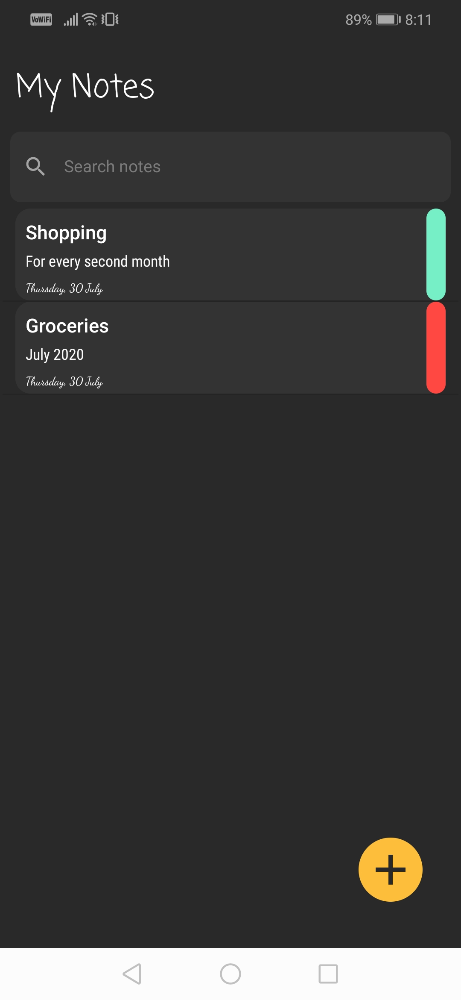
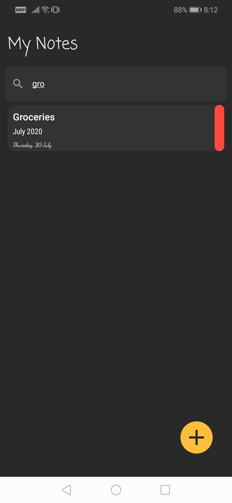
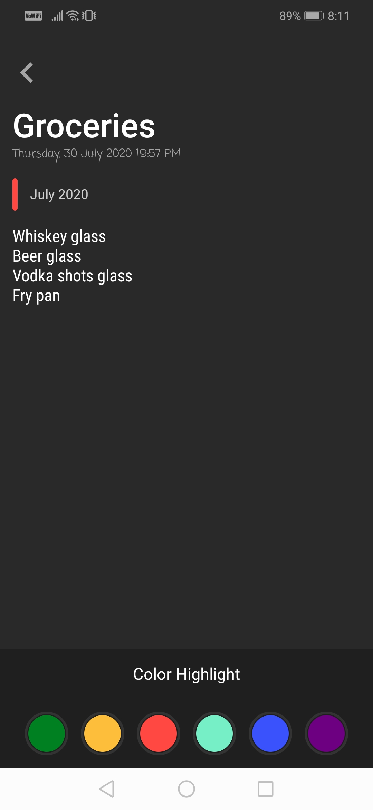
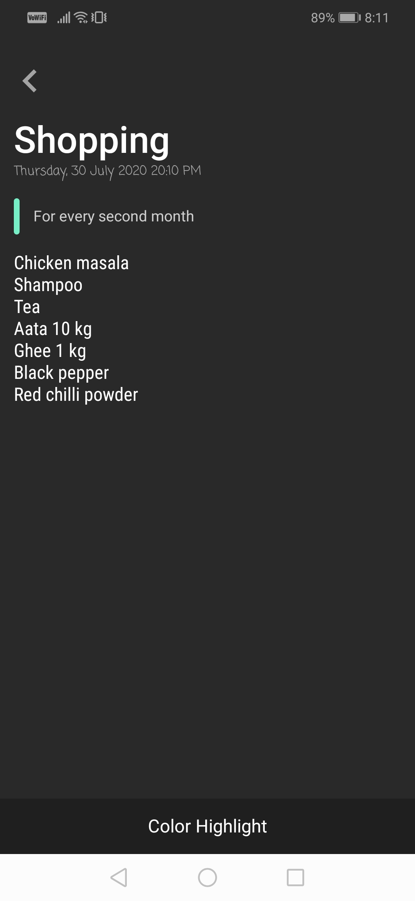
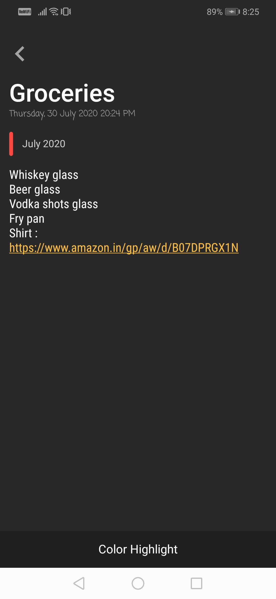

# My Notes
Simple yet elegant notes app can be used as your daily driver. This is a feature rich app and can be used as a decent project to start making your own custom notes app.

## Features
- Lightening fast search from any text in notes
- Auto detect links inside note and smartly makes it clickable
- Save practically infinite notes using fast and powerful sqlite db (Room)
- Tag your note with markers/highlighters to easily identify and categorize notes to make your work easy

## Screenshots
            

## Future work
- Add image support inside note
- QR code scanner
- Document scanner
